<h1 align="center">ccbot — “Charlie-Charlie” 📻</h1>

<p align="center"><b>Your whole fleet of terminal AI agents, on the radio in one Telegram group.</b></p>

<p align="center">
  <a href="https://github.com/MrCryptoHat/ccbot/actions/workflows/tests.yml"></a>
  <a href="LICENSE"></a>
  <a href="pyproject.toml"></a>
  
</p>

<table>
<tr>
<td width="345" valign="top">
  <a href="docs/images/hero.mp4">
    
  </a>
  <p align="center"><sub>▶︎ 30-second demo — <a href="docs/images/hero.mp4">HD video</a></sub></p>
</td>
<td valign="top">

ccbot is a **self-hosted Telegram bot** that remote-controls terminal AI
coding agents — **Claude Code** first-class, **OpenAI Codex** built-in,
[others pluggable](docs/adding-a-runtime.md) — running in **tmux** on your
own machine or server.

One forum group becomes mission control for the whole fleet: each topic is
one agent, replies stream in, and you steer the **real CLI** — your existing
subscription, config and MCP servers work as-is. No LLM API keys, no
per-token costs, no third-party relay. Sessions outlive the bot:
`tmux attach` back into the same terminal anytime.

- **Start a refactor at your desk, approve its plan from the couch,** `tmux attach` back whenever you want.
- **Run a second agent on the same project in parallel** — one tap, zero conflicts: each gets its own branch on a git worktree.
- **Never wonder what an agent is up to** — live terminal screenshots, 👀 read-acks, typing indicators.
- **One bot, one group, no key zoo** — dev projects and personal agents side by side.

</td>
</tr>
</table>

## What you can do from your phone

<table>
<tr>
<td width="42%">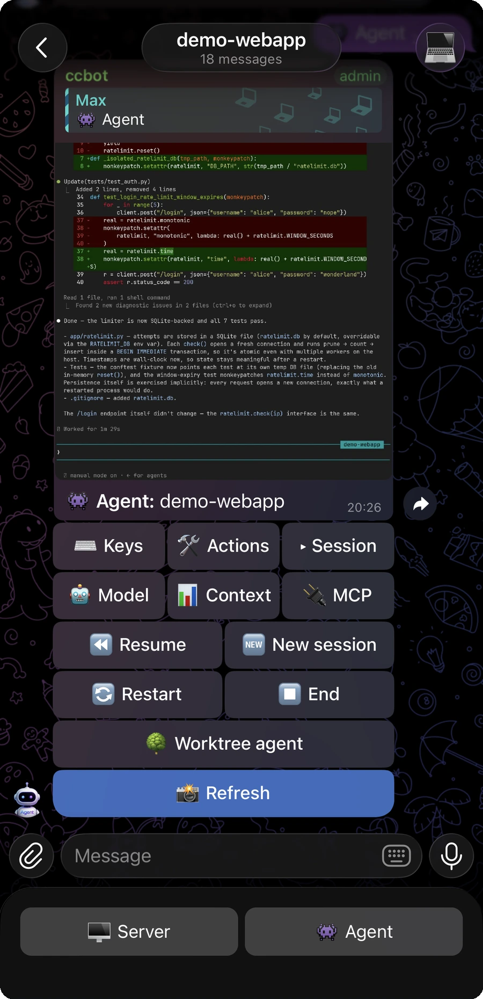</td>
<td>

### Control the real terminal
Screenshot the live terminal any moment and press keys — arrows, Enter, Esc,
Ctrl-C. Interrupt the agent mid-turn, switch model or mode, compact or clear
the session. **Your terminal, in your pocket** — not a chat that paraphrases it.

</td>
</tr>
<tr>
<td>

### Fork a parallel agent in one tap
Tap 🌳, name the task — you get a branch, an isolated `git worktree` and a
fresh agent in its own topic (seconds, plus dependency install on the first
run). Isolated working trees, so agents don't trip over each other's files.
Merged work cleans up automatically;
[**unmerged work is never silently destroyed**](.claude/rules/worktree-agents.md).

</td>
<td width="42%">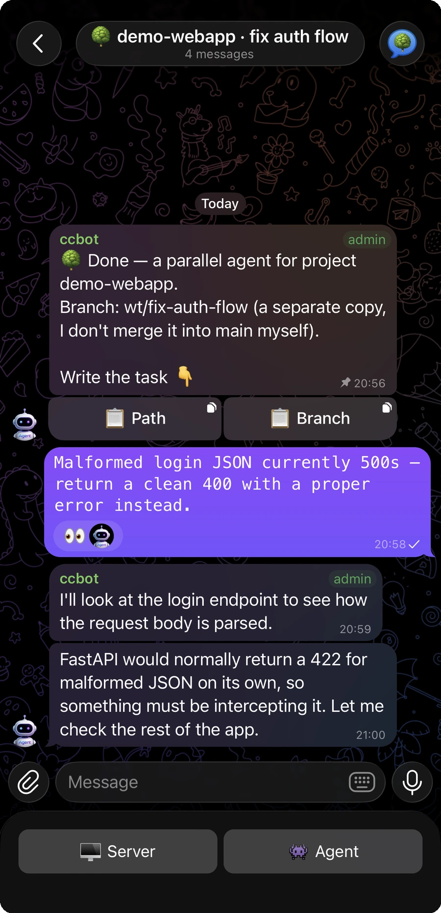</td>
</tr>
<tr>
<td width="42%">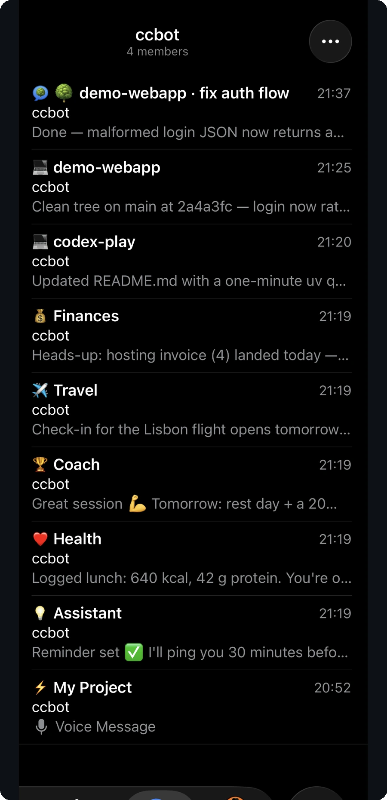</td>
<td>

### One bot = the whole fleet
Many projects, many agents, personal assistants — side by side in one group,
under one bot token. Topics are created and bound by name; close a topic,
and its agent is gone. **No bot-per-agent, no token sprawl.**

</td>
</tr>
<tr>
<td>

### Answer any interactive prompt
Permission dialogs, plan approvals, option pickers, login screens — whatever
the terminal shows arrives as a screenshot with an <code>↑ ↓ ⏎ Esc</code> keyboard.
**Approve a commit from the bus.** Or just 👍 the agent's question to say yes.

</td>
<td width="42%">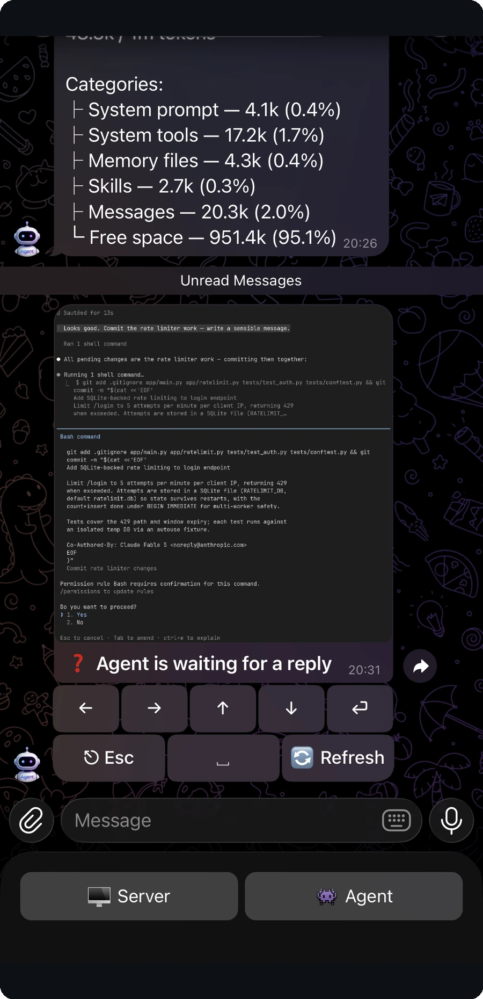</td>
</tr>
<tr>
<td width="42%">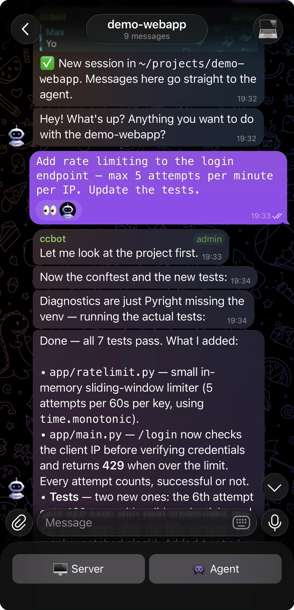</td>
<td>

### Always know what your agent is doing
👀 on your message is the agent's *"copy that"* — your message actually
**entered the agent's context** (not just got delivered). `typing…` means
it's working. The panel shows you the raw terminal whenever you're curious.
No more "what is it even doing right now?"

</td>
</tr>
<tr>
<td>

### Run Claude Code and Codex side by side
Each topic picks which CLI it runs — Claude Code or Codex. The resume picker
has a tab per installed CLI with every past session ready to continue. A
third agent CLI is [one subclass away](docs/adding-a-runtime.md).

</td>
<td width="42%">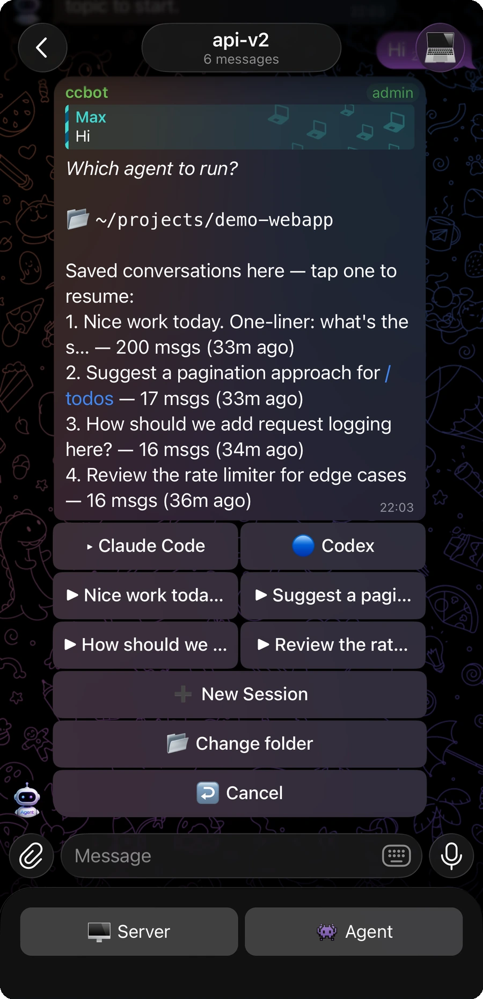</td>
</tr>
<tr>
<td width="42%">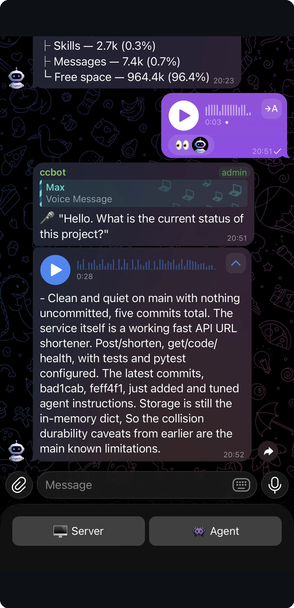</td>
<td>

### Talk to your agents
Dictate a task on the walk home and get a spoken reply back — bring a
Deepgram or OpenAI key for transcription, and a TTS key if you want the
agent to **answer in voice**.

</td>
</tr>
<tr>
<td>

### Get real work products, rendered right
Red/green **diff screenshots** of every edit (opt-in `/diff`), native Telegram
tables, long code as files, auto-pinned task history — and the agent can send
you **any file from the server** straight into the chat.

</td>
<td width="42%">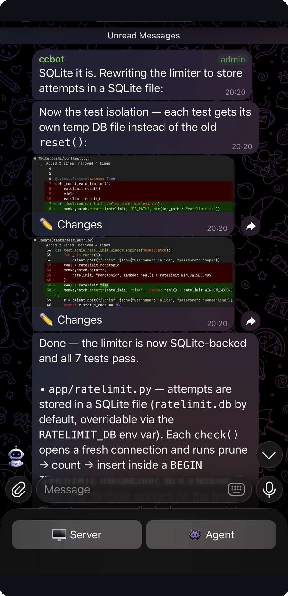</td>
</tr>
</table>

<details>
<summary><b>More screenshots</b> — plan approvals, options widget, Codex approvals, /context, tables, pinned tasks, file delivery</summary>
<p align="center">
  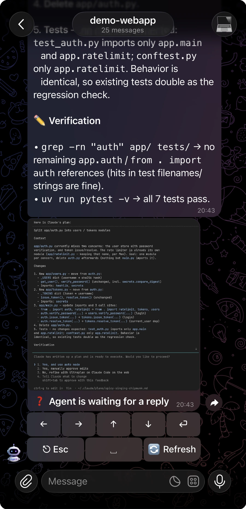
  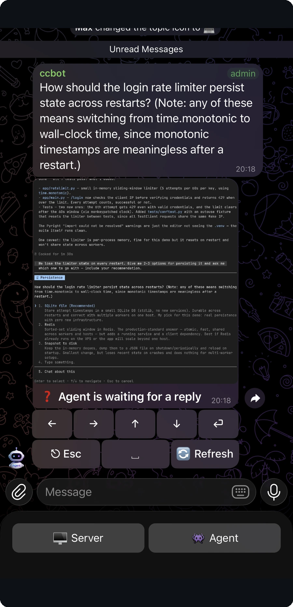
  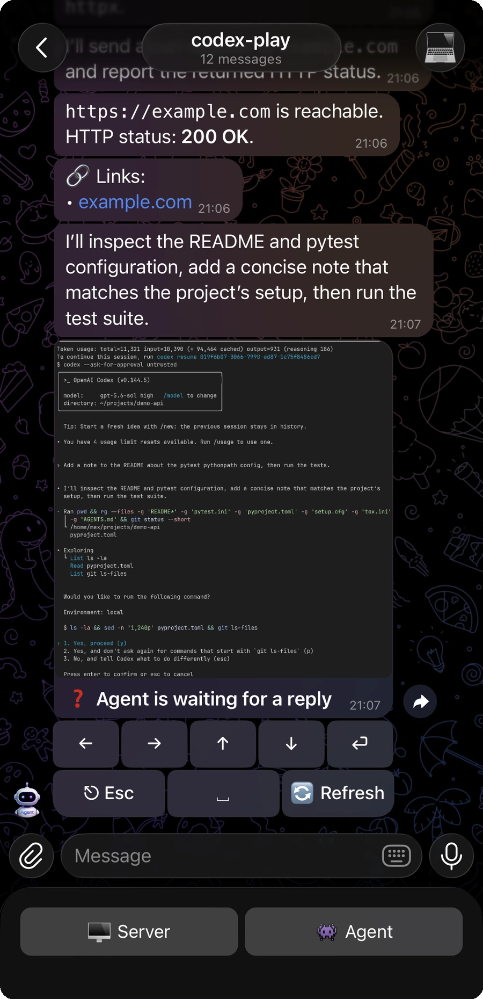
  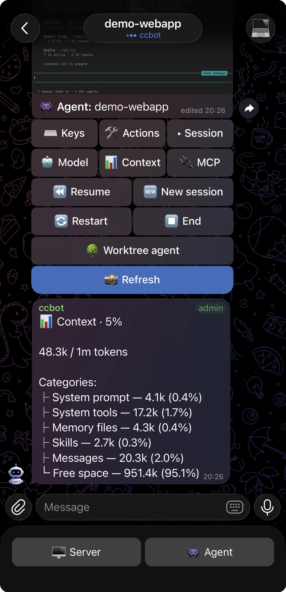
</p>
<p align="center">
  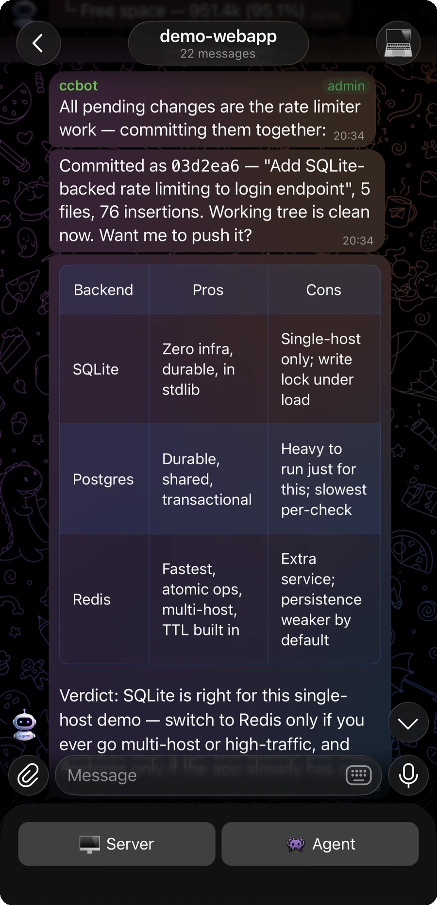
  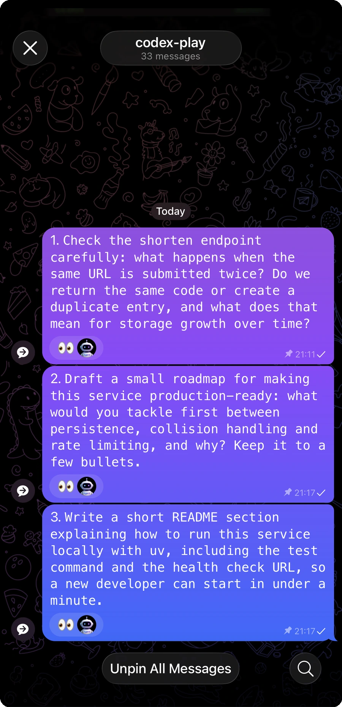
  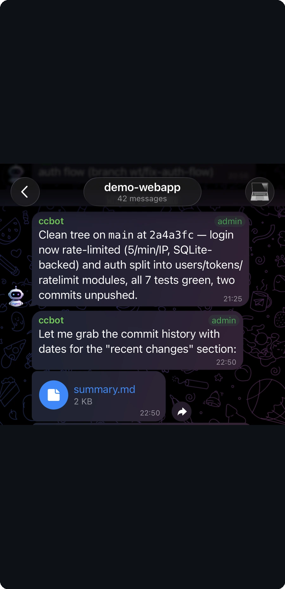
</p>
</details>

## Why drive tmux instead of an API?

Your coding agent runs in your terminal. When you step away, the session
keeps working — but you lose visibility and control. ccbot's key design
choice is that it drives **tmux**, not an agent SDK: the agent process stays
exactly where it is; ccbot reads its transcript and sends keystrokes to the
pane. So:

- **Switch desktop → phone mid-conversation** — the session was never interrupted.
- **Switch back anytime** — `tmux attach` and you're in the terminal with full scrollback.
- **Nothing is lost if the bot dies** — sessions live in tmux, not in ccbot; every topic remembers its project and can resume any session.
- **It survives agent-CLI updates gracefully** — the TUI patterns are pinned per version, and a built-in canary alerts you when a CLI silently self-updates.

The terminal stays the source of truth; ccbot is a thin control layer over it.

## How it compares

| | **ccbot** | Claude Code remote (official) | Happy | Omnara | API-based Telegram bots |
|---|---|---|---|---|---|
| Client | Telegram — nothing to install | Claude app / web | dedicated mobile app | dedicated app + web | Telegram |
| Where the agent runs | your machine, in tmux | your machine, via Anthropic's cloud relay (or Anthropic-hosted on the web) | your machine, via relay | via relay / cloud | the bot re-runs an LLM via API |
| Agents | Claude Code + Codex + pluggable | Claude Code only | Claude Code + Codex | several, via SDK | whatever the API is |
| Your existing plan, no per-token cost | ✅ | ✅ | ✅ | ✅ | ❌ pays per API token |
| Raw-terminal control | ✅ key presses + live terminal screenshots | partial | partial | partial | ❌ |
| 1-tap parallel git-worktree agents | ✅ | — | — | — | ❌ |
| Extra middleman in the path | **none beyond Telegram itself** | Anthropic cloud | relay server | relay / cloud | varies |
| `tmux attach` back into the session | ✅ | partial | ❌ | ❌ | ❌ |
| License / price | MIT, free | proprietary | MIT, free | freemium SaaS (OSS archived) | varies |

<sup>Architecture snapshot, mid-2026 — not a feature audit; verify before you rely on a cell.</sup>

## Quick start

Works on Linux and macOS. Prerequisites: **tmux** (Ubuntu:
`sudo apt install tmux`), the **`claude`** CLI (and/or **`codex`**), and
**[uv](https://docs.astral.sh/uv/)** (one-line installer on their site).

First time with Telegram bots? Get a token from
[@BotFather](https://t.me/BotFather) and your numeric user ID from
[@userinfobot](https://t.me/userinfobot) — or just follow
**[SETUP.md](SETUP.md)** step by step.

```bash
git clone https://github.com/MrCryptoHat/ccbot.git
cd ccbot
uv sync
cp .env.example .env         # set TELEGRAM_BOT_TOKEN + ALLOWED_USERS
uv run ccbot hook --install  # required — without it replies never reach the chat
./scripts/restart.sh         # first start too: creates the tmux session and launches
```

Create a Telegram group, enable **Topics**, add your bot as admin — every
topic you create becomes an agent. **You're on the air.**

Only two variables are required:

| Variable             | Description                                        |
| -------------------- | -------------------------------------------------- |
| `TELEGRAM_BOT_TOKEN` | Bot token from [@BotFather](https://t.me/BotFather) |
| `ALLOWED_USERS`      | Your numeric Telegram user ID (get it from [@userinfobot](https://t.me/userinfobot)); comma-separated for several |
| `CCBOT_USER_ALIASES` | Optional `alias:canonical` id pairs — extra ids that act as the *same* user (a second account, or `1087968824` = @GroupAnonymousBot so posting as an anonymous admin still reaches your own topics) |

Everything else is optional with a sane default — see
[`.env.example`](.env.example) for the full annotated list.

> **You don't need any scary flags**: permission prompts arrive in Telegram
> and you approve them with a tap. For fully unattended runs there is
> `CLAUDE_COMMAND=claude --dangerously-skip-permissions` — ⚠️ the agent then
> runs shell commands and edits files without asking; fine on a VPS that
> holds only your own projects, risky anywhere else.

<details>
<summary><b>Core vs optional</b> — what runs out of the box vs what you switch on</summary>

ccbot runs as a **minimal tmux↔agent bridge** out of the box and grows extra
capabilities as you set env vars. Nothing optional runs unless you turn it on.

| Feature                    | Enabled by                                   |
| -------------------------- | -------------------------------------------- |
| Core tmux bridge           | always on (the two required vars)            |
| Codex runtime (2nd CLI)    | `codex` on PATH (auto-detected; `CODEX_*` vars tune it) |
| Voice transcription / TTS  | a provider key (`DEEPGRAM_/OPENAI_/GEMINI_/ELEVENLABS_…`) |
| Docker agents              | `DOCKER_AGENTS_ENABLED=true` + `DOCKER_AGENTS` ([docs](docs/docker-agents.md)) |
| 👍-to-confirm reactions     | `REACTION_CONFIRM_ENABLED` (on by default)   |
| 👀 read-ack reactions       | `CCBOT_REACTION_ACK` (on by default)         |
| Task pinning               | `CCBOT_PIN_DEFAULT` (on by default)          |
| Edit-diff screenshots      | `/diff` per topic                             |
| Task-injection socket      | `CCBOT_INJECT_TOKEN`                          |

</details>

<details>
<summary><b>Plugins</b> — deployment-specific extensions without touching core</summary>

Heavier integrations live as separate `ccbot.<name>` packages, loaded only
when named in `CCBOT_PLUGINS` (comma-separated); the public tree ships none
and always runs standalone. A plugin can contribute i18n strings, bot
commands, handlers, startup/shutdown hooks, `/status` sections and buttons,
and its own inline-keyboard callbacks. Drop `src/ccbot/<name>/` into your
checkout, list `<name>` in `CCBOT_PLUGINS`, done — core never references
specific plugins. Full contract with docstrings:
[`src/ccbot/plugins.py`](src/ccbot/plugins.py).

</details>

<details>
<summary><b>Architecture &amp; internals</b></summary>

The design, module map, topic/binding lifecycle and per-subsystem rules live
in [`CLAUDE.md`](CLAUDE.md) and [`.claude/rules/`](.claude/rules/) —
`architecture.md` is the orientation map. Every `.py` file carries a module
docstring describing its responsibilities.

Session tracking is hook-based: `uv run ccbot hook --install` registers a
`SessionStart` hook that maps tmux windows to agent sessions (uninstall with
`--uninstall` **before** deleting the checkout). Want ccbot to drive another
agent CLI (Gemini CLI, Aider, …)? That's one runtime subclass —
see **[docs/adding-a-runtime.md](docs/adding-a-runtime.md)**.

Tech stack: Python, [python-telegram-bot](https://python-telegram-bot.org/),
tmux, [uv](https://docs.astral.sh/uv/). Dev checks: `uv run ruff check`,
`uv run pyright src/ccbot/`, `uv run pytest -q`.

</details>

## Security model

Short version: treat the bot like SSH access, because that's what it is.

- **`ALLOWED_USERS` = operator access.** Anyone on that list drives your
  agents, and an agent can run shell commands — so a listed user effectively
  has a shell on the host. Add people the way you'd hand out SSH keys.
- **The bot token is the crown jewels.** Whoever holds it reads everything
  the bot posts and can send commands in its name. It lives in `.env`
  (gitignored); rotate it via BotFather if it ever leaks.
- **Telegram is in the path — and it's the only thing that is.** Messages,
  screenshots and files transit Telegram's Bot API like any bot traffic;
  there is no other relay and nothing else stores your transcript. Remember
  that a terminal screenshot shows whatever is on screen — including secrets
  in scrollback — and everything the bot posts is visible to **every member
  of the group**. Keep the group private.
- **The automation socket is off by default** and, when enabled, binds a
  local unix socket (not TCP) gated by a token — unreachable from outside
  the host.
- **Agent CLIs self-update silently**; ccbot pins its terminal-parsing
  patterns per version and a built-in canary warns you when a CLI version
  changes, instead of quietly misbehaving.

Vulnerability reports: see [SECURITY.md](SECURITY.md).

## FAQ

**How do I control Claude Code from my phone?**
Run ccbot on the machine where Claude Code runs and add its bot to a Telegram
group with Topics enabled. Each topic becomes a remote for one session —
replies stream in, you press keys, approve prompts, and see the live terminal.

**Does ccbot use the Claude API or my Claude subscription?**
Your subscription. It drives the real `claude` CLI in tmux, so your plan,
config, memory and MCP servers apply unchanged and there is **no extra token
cost** — ccbot never calls an LLM API for the conversation. (The optional
voice features are the one exception: transcription and TTS use their own
provider keys.)

**Can I run several coding agents in parallel on one project?**
Yes — each topic is its own tmux window, and the 🌳 button forks a
`git worktree` + branch into a fresh topic, so parallel agents never collide.

**How do I approve agent permission prompts remotely?**
Permission dialogs, plan approvals and option pickers arrive as pane
screenshots with an `↑ ↓ ⏎ Esc` keyboard — tap to answer. A 👍 reaction on
the agent's question also confirms it.

**Does it support OpenAI Codex or other CLI agents?**
Codex is built in: install `codex` and a Codex tab appears in the session
picker — nothing to configure. Other terminal agents are one runtime subclass
away ([guide](docs/adding-a-runtime.md)).

**What happens if the bot or the server restarts?**
The conversation isn't lost. Sessions live in tmux/Claude Code, not in the
bot: if only ccbot restarts, agents don't even notice; after a full server
reboot a running turn is interrupted, but each topic remembers its project
and resumes its session from the picker.

**How is this different from Happy, Omnara, or Claude Code's own remote control?**
Those run through a hosted app or cloud relay. ccbot is self-hosted, uses a
chat app you already have, gives raw keypress control of the real terminal —
and you can always `tmux attach` back. See [How it compares](#how-it-compares).

**Why "ccbot" — what does "cc" mean?**
On the radio, "cc" reads *Charlie-Charlie* — fitting for a bot whose job is
keeping your agent fleet on the air. Historically it meant *Claude Code*.
And yes, it can also literally press `Ctrl-C` — from your phone.

**Is my code exposed to a third party?**
No middleman: traffic flows between your server and Telegram's Bot API under
your own bot token. Mind the trust boundary inside Telegram itself:
`ALLOWED_USERS` controls who can *drive* the bot, while everything the bot
posts — replies, pane screenshots, files — is visible to **every member of
the group**. Keep the group private and invite only people you'd let read
your terminal.

## Credits & license

Actively developed — the author drives his own agent fleet with it every
day. Release history in [CHANGELOG.md](CHANGELOG.md).

Forked from and originally created by [six-ddc/ccmux](https://github.com/six-ddc/ccmux).
MIT licensed — see [LICENSE](LICENSE).
